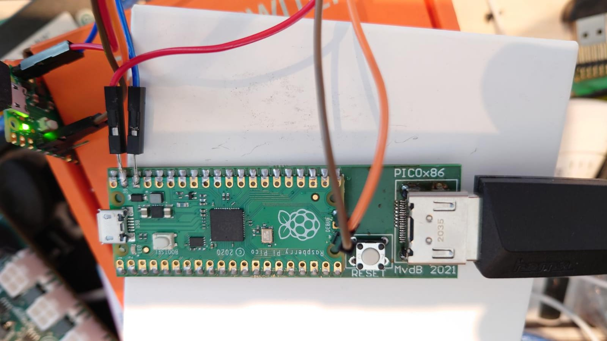
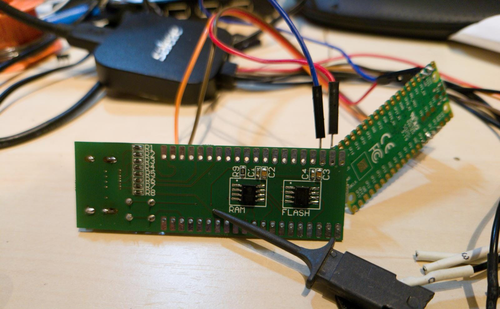
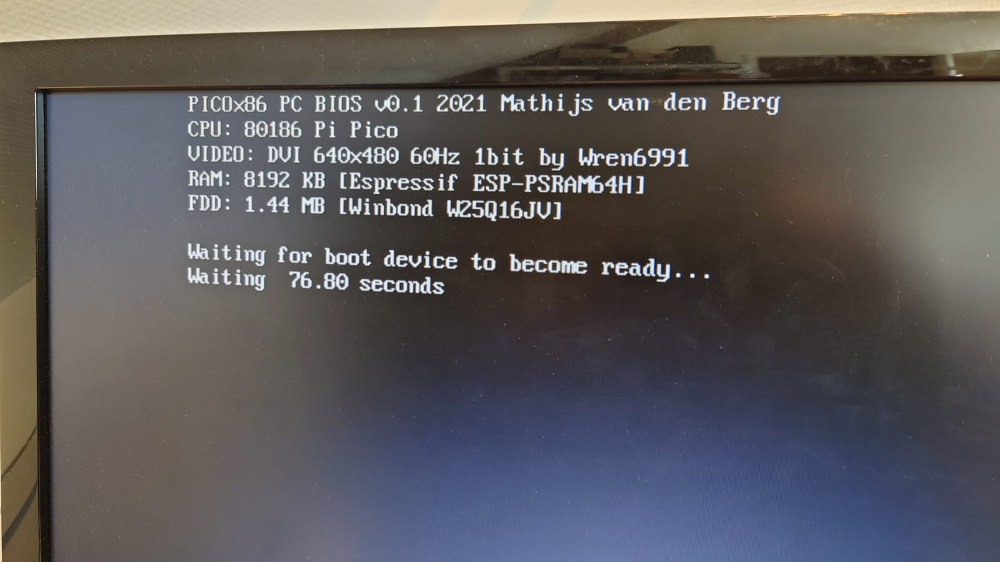
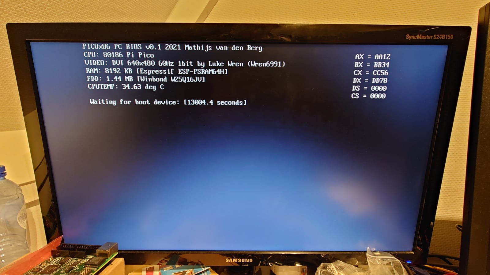

# picox86
x86 emulator on Raspberry Pi Pico

Quick links:

[Wren6991 PicoDVI](https://github.com/Wren6991/PicoDVI)

[Next186](https://opencores.org/projects/next186_soc_pc/)

About this Project
-----------------

I started this project inspired by the fact that the Pi Pico can actually output DVI streams without any external component (only 8 resistors and a connector). This is found and proved by Engineer Wren6991 (Check his PicoDVI repository [here](https://github.com/Wren6991/PicoDVI))

A similar x86 project is also made by Nicolae Dumitrache with his FPGA version of a 80186. This is a complete working solution, however I think it would be very cool if a simple MCU can have a minimal implementation too using PIO,DMA and some trial and error.

Hardware used on bottom of PCB:

- SPI Flash chip 16Mbit (for storing FDD image to boot from, Goal is that this can be programmed in circuit by USB or TTL UART)
- QSPI PSRAM 64Mbit (can clock up to 133 MHz / 4bit) which results in up to 66 Mbyte/sec sequential access and about 13 Mbyte/sec random access. Goal is to offload the RAM access with PIO and a small cache.

